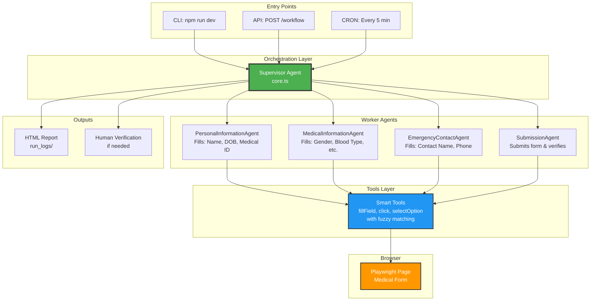

# Architecture Overview

## System Architecture Diagram

```mermaid
graph TB
    subgraph "Entry Points"
        CLI[CLI: npm run dev]
        API[API: POST /workflow]
        CRON[CRON: Every 5 min]
    end
    
    subgraph "Orchestration Layer"
        SUPERVISOR[Supervisor Agent<br/>core.ts]
    end
    
    subgraph "Worker Agents"
        PERSONAL[PersonalInformationAgent<br/>Fills: Name, DOB, Medical ID]
        MEDICAL[MedicalInformationAgent<br/>Fills: Gender, Blood Type, etc.]
        EMERGENCY[EmergencyContactAgent<br/>Fills: Contact Name, Phone]
        SUBMIT[SubmissionAgent<br/>Submits form & verifies]
    end
    
    subgraph "Tools Layer"
        TOOLS[Smart Tools<br/>fillField, click, selectOption<br/>with fuzzy matching]
    end
    
    subgraph "Browser"
        PAGE[Playwright Page<br/>Medical Form]
    end
    
    subgraph "Outputs"
        LOGS[HTML Report<br/>run_logs/]
        VERIFY[Human Verification<br/>if needed]
    end
    
    CLI --> SUPERVISOR
    API --> SUPERVISOR
    CRON --> SUPERVISOR
    
    SUPERVISOR --> PERSONAL
    SUPERVISOR --> MEDICAL
    SUPERVISOR --> EMERGENCY
    SUPERVISOR --> SUBMIT
    
    PERSONAL --> TOOLS
    MEDICAL --> TOOLS
    EMERGENCY --> TOOLS
    SUBMIT --> TOOLS
    
    TOOLS --> PAGE
    
    SUPERVISOR --> LOGS
    SUPERVISOR --> VERIFY
    
    style SUPERVISOR fill:#4CAF50,stroke:#333,stroke-width:3px,color:#fff
    style TOOLS fill:#2196F3,stroke:#333,stroke-width:2px,color:#fff
    style PAGE fill:#FF9800,stroke:#333,stroke-width:2px,color:#fff
```