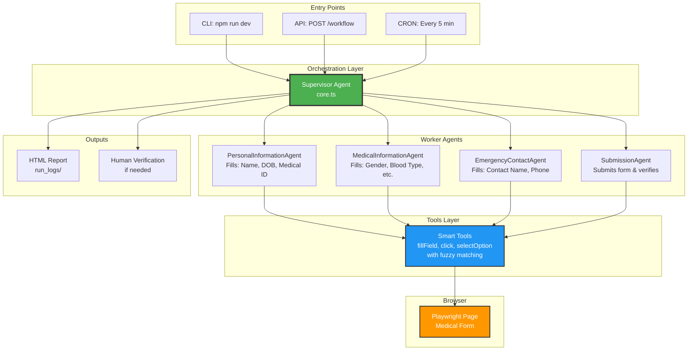

# Architecture Overview

## System Architecture Diagram



## Workflow Execution Flow

1. **Entry Point** triggers the Supervisor (CLI, API, or CRON)
2. **Supervisor** orchestrates 4 specialized agents sequentially
3. Each **Worker Agent** uses smart tools to interact with the browser
4. **Tools** perform fuzzy matching to find elements reliably
5. **Outputs** include audit logs and optional human verification

## Design Decisions

### 1. Multi-Agent Architecture (Supervisor-Worker Pattern)

**Why?** Magical's video emphasized that "agents are purpose-built to be predictable."

- **Supervisor Agent** (`core.ts`): Orchestrates the overall workflow
- **Worker Agents**: Each handles a single form section
  - `PersonalInformationAgent`: First name, last name, DOB, medical ID
  - `MedicalInformationAgent`: Gender, blood type, allergies, medications
  - `EmergencyContactAgent`: Emergency contact name and phone
  - `SubmissionAgent`: Submits form and verifies success

**Benefits:**
- Reduced hallucinations (smaller context per agent)
- Easier debugging (isolated failures)
- Better retry logic (can retry individual sections)

### 2. Smart Tools with Fuzzy Matching

**Why?** Web UIs change frequently. Hard-coded selectors break easily.

**Strategy:**
```
1. Try by Label (e.g., "First Name")
2. Try by Role + Name (e.g., textbox with accessible name)
3. Try by Placeholder text
4. Try by exact selector (fallback)
```

**Example:** If the "First Name" field changes from `#firstName` to `#first-name`, the agent still finds it by label.

### 3. Audit Trail with Screenshots

**Why?** Magical emphasized "recording every reasoning step."

Every run generates:
- Step-by-step reasoning logs
- Screenshots at each major action
- Tool calls and results
- Timestamp for each step

**Output:** `run_logs/TIMESTAMP/report.html`

### 4. Human-in-the-Loop Verification

**Why?** Healthcare workflows require high reliability.

If automated verification fails:
1. Agent pauses execution
2. Prompts human: "Did the form submit successfully? (y/n)"
3. Human confirms or rejects
4. Workflow continues or fails accordingly

### 5. Evaluation Framework

**Why?** "Use evals frameworks to decide which model is best" (video at 5:01)

`npm run eval` runs the workflow N times and reports:
- Success rate (%)
- Average duration (seconds)
- Failed runs with error details

**Use case:** Test code changes don't break the agent.

## How This Maps to Magical's Production System

| Magical's Approach (Video) | My Implementation |
|----------------------------|-------------------|
| **Multi-Agent Framework** (1:32) - Trigger agent distributes tasks to sub-agents | ✅ Supervisor in `core.ts` orchestrates 4 specialized agents |
| **Constrained Agents** (2:12) - Each agent limited to small workflow subset | ✅ Each agent handles one form section (Personal, Medical, Emergency, Submit) |
| **Tool Calls** (2:39) - Custom tools provided to agents | ✅ Smart tools: `fillField`, `click`, `selectOption` with fuzzy matching |
| **Audit Trail** (3:21) - Every reasoning step recorded with screenshots | ✅ HTML reports in `run_logs/` with step-by-step screenshots |
| **Human-in-the-Loop** (4:07) - Agent pauses for human input when stuck | ✅ Verification fallback prompts user if automated checks fail |
| **Evaluations** (5:01) - Model comparison with success/cost metrics | ✅ `npm run eval` - runs N iterations, reports success rate & duration |
| **Queue-based Orchestration** (1:48) - Trigger agent manages workflow queue | ✅ CRON scheduler (`start:server`) acts as simple queue |

## Production Considerations

In a production deployment, this system would benefit from:

### Infrastructure
- **VM Isolation**: Run each agent in isolated containers (mentioned at 3:52 in video)
- **Persistent Queue**: Replace CRON with BullMQ + Redis for:
  - Job persistence across restarts
  - Horizontal scaling with multiple workers
  - Better retry/failure handling
  - Priority queues

### Observability
- **Cost Tracking**: Log token usage per run for model optimization
- **Model A/B Testing**: Compare Gemini Flash vs Pro for cost/accuracy tradeoffs
- **Metrics Dashboard**: Track success rate, duration, error types over time
- **Alerting**: Notify on-call when success rate drops below threshold

### Reliability
- **Graceful Degradation**: If one agent fails, save partial progress
- **Idempotency**: Ensure workflows can be safely retried
- **Rate Limiting**: Prevent overwhelming the target website
- **Circuit Breaker**: Pause execution if repeated failures detected

## File Structure

```
src/
├── agent/
│   ├── core.ts          # Supervisor orchestrator
│   ├── worker.ts        # Reusable worker agent loop
│   ├── tools.ts         # Smart tools (fillField, click, etc.)
│   ├── logger.ts        # Structured logging + HTML reports
│   └── verifier.ts      # Success verification logic
├── scripts/
│   └── run_evals.ts     # Evaluation framework
├── server/
│   └── index.ts         # Hono API + CRON scheduler
└── _internal/
    ├── setup.ts         # Model configuration
    └── run.ts           # CLI entry point
```

## Technology Stack

- **AI SDK**: Vercel AI SDK with Google Gemini
- **Browser Automation**: Playwright
- **Web Server**: Hono
- **Scheduling**: node-cron
- **Language**: TypeScript
